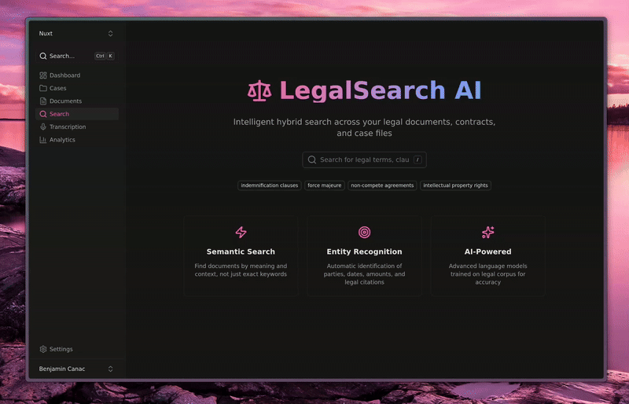

# LegalEase

<p align="center">
  
</p>

<p align="center">
  <a href="https://github.com/alliecatowo/legalease-ai/blob/main/LICENSE">
    
  </a>
  <a href="https://github.com/alliecatowo/legalease-ai/stargazers">
    
  </a>
  <a href="https://github.com/alliecatowo/legalease-ai/network/members">
    
  </a>
  
  
  
  
  
  <a href="https://github.com/alliecatowo/legalease-ai/commits/main">
    
  </a>
</p>

---

LegalEase is a cloud-native workspace for legal teams to organise case material, process documents, transcribe audio/video, and run AI-powered search. Built on Firebase and Google Cloud, it provides scalable document management with intelligent AI features powered by Gemini and Chirp models.

**Key Features:**
- Case-centric document intake with automatic metadata extraction
- AI-powered transcription with Google Cloud Speech-to-Text (Chirp 3) and speaker diarization
- Transcript summarization using Gemini 2.5 Flash
- Hybrid search with vector embeddings via Qdrant Cloud
- Real-time collaboration with Firestore
- Serverless architecture with Firebase Cloud Functions

---

## Architecture Overview

| Component | Role | Notes |
|-----------|------|-------|
| `frontend/` (Nuxt 4) | Dashboard, upload flows, search UI, transcript review | Nuxt UI v3, Firebase Auth |
| `functions/` (Genkit) | AI flows: transcription, summarization, search, indexing | Firebase Cloud Functions (2nd Gen) |
| Firebase Auth | User authentication | Google, Email/Password providers |
| Cloud Firestore | Primary database for cases, documents, transcripts | Real-time sync |
| Cloud Storage | File storage for uploads | Integrated with Firebase |
| Qdrant Cloud | Vector search for document embeddings | Hybrid search support |
| Google Cloud Speech-to-Text | Audio/video transcription | Chirp 3 model with diarization |
| Gemini 2.5 Flash | Summarization and AI analysis | Via Genkit |

---

## Quick Start

### Prerequisites

- [mise](https://mise.jdx.dev) for task management
- Node.js 22+ and pnpm
- Firebase CLI (`npm install -g firebase-tools`)
- A Firebase project with Blaze (pay-as-you-go) plan

### 1. Clone and install

```bash
git clone https://github.com/alliecatowo/legalease-ai.git
cd legalease-ai

mise install      # installs all tools defined in .mise.toml
```

### 2. Configure environment

```bash
# Frontend
cp frontend/.env.example frontend/.env
# Edit with your Firebase config

# Functions
cd functions
cp .env.example .env
# Add QDRANT_URL, QDRANT_API_KEY, etc.
```

### 3. Deploy functions

```bash
cd functions
npm install
npm run build
mise run firebase -- deploy --only functions
```

### 4. Run frontend locally

```bash
cd frontend
pnpm install
pnpm dev
```

The frontend will be available at http://localhost:3000

---

## AI Features

### Transcription

Upload audio/video files to get:
- Full transcript text with automatic punctuation
- Speaker diarization (identifies different speakers)
- Timestamped segments
- Detected language

**Technical Details:**
- Uses Google Cloud Speech-to-Text V2 API
- Chirp 3 model for best accuracy (via `us` multi-region endpoint)
- Supports files up to 8 hours via BatchRecognize
- Speaker diarization with 1-6 speaker detection

### Summarization

Transcripts can be summarized using Gemini 2.5 Flash:
- Brief 2-3 sentence summaries
- Key moments extraction
- Action items identification

### Search

Documents and transcripts are indexed for hybrid search:
- Dense vector embeddings via Gemini
- Stored in Qdrant Cloud
- Case-scoped search results

---

## Project Structure

```
legalease/
├── frontend/           # Nuxt 4 dashboard
│   ├── app/
│   │   ├── components/ # Vue components
│   │   ├── composables/# Reusable logic (useAI, useFirestore, etc.)
│   │   ├── pages/      # Route pages
│   │   └── types/      # TypeScript types
│   └── nuxt.config.ts
├── functions/          # Firebase Cloud Functions
│   ├── src/
│   │   ├── flows/      # Genkit AI flows
│   │   │   ├── transcription.ts
│   │   │   ├── summarization.ts
│   │   │   └── search.ts
│   │   └── index.ts    # Function exports
│   └── package.json
└── landing/            # Marketing site (Nuxt Content)
```

---

## Genkit AI Flows

### `transcribeMedia`

Transcribes audio/video using Google Cloud Speech-to-Text V2.

**Input:**
```typescript
{
  gcsUri: string      // GCS URI (gs://bucket/path)
  language?: string   // BCP-47 code, defaults to "en-US"
  enableDiarization?: boolean  // Default: true
  enableSummary?: boolean      // Default: false
  maxSpeakers?: number         // Default: 6
}
```

**Output:**
```typescript
{
  fullText: string
  segments: Array<{
    id: string
    start: number
    end: number
    text: string
    speaker?: string
    confidence?: number
  }>
  speakers: Array<{ id: string, inferredName?: string }>
  duration?: number
  language?: string
  summary?: string
}
```

### `summarizeTranscript`

Generates summaries using Gemini 2.5 Flash.

### `indexDocument` / `searchDocuments`

Vector search operations with Qdrant Cloud.

---

## Local Development

LegalEase can run fully locally using Firebase emulators and Docker services. This is useful for development and testing without incurring cloud costs.

### Prerequisites

- [Docker](https://docs.docker.com/get-docker/) and Docker Compose
- [mise](https://mise.jdx.dev) for task management
- Node.js 22+ and pnpm

### Quick Start (One Command)

```bash
# Start everything: Docker services + Firebase emulators + Frontend
mise run dev:local
```

This will:
1. Start Docker services (Qdrant, Docling)
2. Build and start Firebase Functions emulator
3. Start Firestore, Auth, and Storage emulators
4. Create a test user: `test@example.com` / `password123`
5. Start the frontend at http://localhost:3000

### Service URLs

| Service | URL |
|---------|-----|
| Frontend | http://localhost:3000 |
| Firebase Emulator UI | http://localhost:4000 |
| Docling UI | http://localhost:5050/ui |
| Qdrant Dashboard | http://localhost:6333/dashboard |

### Individual Commands

```bash
# Start only Docker services (Qdrant, Docling)
mise run services:up

# Start only Firebase emulators
firebase emulators:start --only functions,firestore,auth,storage

# Start only frontend (assumes emulators running)
cd frontend && NUXT_PUBLIC_USE_EMULATORS=true pnpm dev

# Stop Docker services
mise run services:down
```

### Test User

The emulator data includes a pre-seeded test user:
- **Email:** test@example.com
- **Password:** password123

Or create your own through the Firebase Auth emulator UI (http://localhost:4000).

### Configuration

Local development uses environment variables to switch between local and cloud services:

```bash
# .mise.toml sets these by default for local dev
QDRANT_LOCAL=true      # Use local Qdrant (no API key needed)
QDRANT_URL=http://localhost:6333
```

You can mix local and cloud services:
- Firebase emulators + Qdrant Cloud: Set `QDRANT_LOCAL=false` and configure secrets
- Production Firebase + Local Qdrant: Run `mise run dev` with `QDRANT_LOCAL=true`

### GPU Acceleration (Optional)

If you have an NVIDIA GPU with nvidia-container-toolkit, edit `docker-compose.yml` to enable GPU for the Docling service, then restart:

```bash
mise run services:down
mise run services:up
```

---

## Production Development

### Run frontend against production Firebase

```bash
mise run dev
```

### Deploy

```bash
# Functions only
mise run deploy:functions

# Hosting only
mise run deploy:hosting

# Everything
mise run deploy
```

---

## Feature Status

| Area | Status |
|------|--------|
| Case management, document upload | ✅ Production ready |
| Transcription (Chirp 3 + diarization) | ✅ Production ready |
| Summarization (Gemini) | ✅ Production ready |
| Vector search (Qdrant) | ✅ Functional |
| Waveform player | ⚠️ In progress |
| Export (DOCX, SRT, VTT) | ⚠️ In progress |

---

## Contributing

Open issues or pull requests are welcome. For larger changes, start a discussion in the issue tracker.

---

## License

MIT License. See [`LICENSE`](LICENSE) for details.
